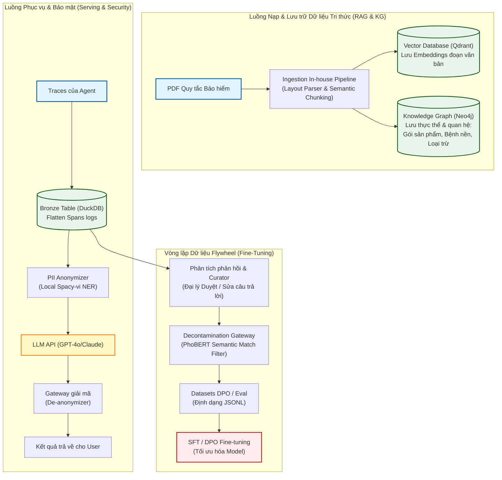

# Thiết kế Hệ thống Agent Flywheel & RAG Hỗ trợ Tư vấn Bảo hiểm Nhân thọ tại Việt Nam

## 1. Bài toán & Ràng buộc Thực tế
Hệ thống AI Agent hỗ trợ các đại lý và khách hàng tra cứu, tư vấn các sản phẩm Bảo hiểm nhân thọ tại Việt Nam. Dữ liệu đầu vào gồm:
*   Hàng trăm tài liệu Quy tắc & Điều khoản sản phẩm (dạng PDF chứa nhiều bảng biểu phức tạp, định dạng cột, thuật ngữ pháp lý và thuật ngữ tài chính tiếng Việt).
*   Nhật ký traces tương tác thực tế từ hệ thống chatbot CSKH.

### Ràng buộc thực tế:
1.  **Độ chính xác pháp lý tuyệt đối:** Bảo hiểm nhân thọ là sản phẩm tài chính phức tạp và có tính pháp lý cao. AI không được phép tư vấn sai lệch các điều khoản loại trừ hoặc thời gian chờ, tránh dẫn đến tranh chấp pháp lý hoặc xử phạt từ Bộ Tài chính.
2.  **Tuân thủ Bảo vệ Dữ liệu Cá nhân (PDPL):** Tuân thủ Nghị định 13/2023/NĐ-CP (PDPL) của Việt Nam. Dữ liệu sức khỏe, tài chính nhạy cảm của khách hàng không được gửi ra nước ngoài hoặc lưu trữ không mã hóa.
3.  **Tối ưu hóa Chi phí:** Mô hình ngôn ngữ lớn (LLM) hỗ trợ tiếng Việt tốt (như GPT-4o, Claude 3.5 Sonnet) có chi phí token rất đắt đỏ khi phải nhồi nhét tài liệu dài vào context.

---

## 2. Sơ đồ Kiến trúc Hệ thống

---

## 3. Các Quyết định Thiết kế & Đánh đổi Kỹ thuật

### Quyết định 1: Định dạng dữ liệu thô - Semantic Chunking kết hợp OCR/Layout Parser (Câu 1 & 6)
*   **Thách thức:** Tài liệu bảo hiểm Việt Nam có nhiều bảng biểu phân cấp và điều khoản loại trừ đan xen. Nếu dùng Fixed-size Chunking (ví dụ: cắt mỗi 500 từ), thông tin trong bảng biểu sẽ bị vỡ vụn, khiến RAG không thể trả lời đúng số tiền chi trả hoặc điều kiện áp dụng.
*   **Quyết định:** Sử dụng công cụ Layout Parser (như Unstructured hoặc LayoutLM) kết hợp quy tắc phân tích theo mục lục tài liệu (Semantic Chunking). Dữ liệu được chia nhỏ theo từng "Điều", "Khoản", giữ nguyên cấu trúc phân cấp và gắn kèm siêu dữ liệu (metadata) của chương đó.
*   **Đánh đổi (Semantic Chunking vs Fixed-size):** Semantic Chunking tốn tài nguyên tính toán và lập trình phức tạp hơn nhiều so với Fixed-size, nhưng đảm bảo tính toàn vẹn của ngữ cảnh pháp lý – yếu tố sống còn của bài toán bảo hiểm.

### Quyết định 2: Lựa chọn Mô hình lai Hybrid RAG + Knowledge Graph (Câu 6)
*   **Thách thức:** Khách hàng thường hỏi các câu hỏi so sánh liên kết nhiều bước (Multi-hop) như: *"Tôi bị bệnh tiểu đường tuýp 2 thì gói bảo hiểm A loại trừ những gì so với gói bảo hiểm B?"*. Một hệ thống RAG phẳng (Flat RAG) sẽ chỉ lấy ra các chunk độc lập chứa từ khóa "tiểu đường", "gói A", "gói B" và dễ dàng bỏ sót các điều khoản loại trừ chéo nằm sâu ở phụ lục.
*   **Quyết định:** Xây dựng Knowledge Graph (KG) song song với Vector Database. Thực thể gồm: `Sản_Phẩm` (Gói A, Gói B), `Bệnh_Nền` (Tiểu đường), `Điều_Khoản_Loại_Trừ`. Mối quan hệ được định nghĩa rõ ràng: `(Sản_Phẩm)-[LOẠI_TRỪ]->(Bệnh_Nền)`. Khi nhận câu hỏi, hệ thống sẽ truy vấn KG để đi qua các node nhằm kết nối thông tin chính xác, sau đó dùng Vector Search để lấy chi tiết văn bản gốc làm ngữ cảnh cho LLM.
*   **Đánh đổi (Hybrid KG+RAG vs Pure Vector RAG):** Xây dựng KG tốn chi phí xây dựng ban đầu rất lớn (cần LLM trích xuất thực thể hoặc định nghĩa ontology thủ công). Tuy nhiên, nó mang lại độ chính xác 100% cho các mối quan hệ logic phức tạp, loại bỏ hoàn toàn hiện tượng ảo giác khi so sánh chéo.

### Quyết định 3: Quy định bảo mật Việt Nam - Local PII Anonymization Gateway (Câu 10)
*   **Thách thức:** Để tuân thủ Nghị định 13/2023/NĐ-CP (PDPL), dữ liệu cá nhân nhạy cảm của khách hàng Việt Nam (Họ tên, CCCD, Bệnh án chi tiết, Số điện thoại) không được gửi thẳng sang các API đám mây quốc tế (OpenAI, Anthropic) khi chưa có sự đồng ý rõ ràng của chủ thể dữ liệu.
*   **Quyết định:** Xây dựng một cổng ẩn danh hóa (Anonymization Gateway) chạy tại máy chủ nội bộ (On-premise). Sử dụng mô hình NER tiếng Việt (như PhoNER hoặc Spacy-vi) kết hợp Regex đặc thù để nhận diện thông tin nhạy cảm và thay thế chúng bằng các token tượng trưng (ví dụ: `Nguyễn Văn A` -> `[KHACH_HANG_1]`, `0912345678` -> `[SDT_1]`). Sau khi nhận phản hồi từ LLM bên ngoài, Gateway nội bộ sẽ map ngược lại thông tin thực tế trước khi hiển thị cho người dùng.
*   **Đánh đổi (Local Anonymizer + Cloud LLM vs Pure Local LLM):** Phương án này tăng độ trễ (latency) của mỗi request thêm khoảng 50-100ms do phải xử lý lọc thực thể hai đầu, nhưng giải quyết triệt để bài toán tuân thủ pháp lý PDPL mà không phải đầu tư vận hành cụm GPU đắt đỏ để chạy Local LLM lớn.

### Quyết định 4: Flywheel & Decontamination Ngữ nghĩa (Câu 7)
*   **Thách thức:** Khi lấy traces tương tác của khách hàng từ môi trường production để làm DPO pairs hoặc eval set, chúng ta dễ gặp tình trạng rò rỉ dữ liệu (data leakage) do người dùng hỏi đi hỏi lại cùng một nội dung nhưng sử dụng các từ đồng nghĩa hoặc cấu trúc câu khác nhau (Ví dụ: *"Gói A có bảo hiểm ung thư không?"* và *"Bệnh ung thư có được gói A chi trả không?"*). Lọc trùng khớp chuỗi (Exact match) thông thường sẽ thất bại.
*   **Quyết định:** Áp dụng Semantic Decontamination. Sử dụng mô hình embedding tiếng Việt gọn nhẹ (như PhoBERT hoặc ViDeBERTa) để chuyển đổi toàn bộ câu hỏi trong tập eval và tập train DPO thành các vector biểu diễn. Nếu độ tương đồng Cosine (Cosine Similarity) giữa một câu hỏi trong tập train và bất kỳ câu hỏi nào trong tập eval vượt quá ngưỡng 0.85, cặp DPO đó sẽ bị loại bỏ ngay lập tức.
*   **Đánh đổi (Semantic Decontamination vs Exact Match):** Lọc ngữ nghĩa đòi hỏi tính toán khoảng cách vector và chọn ngưỡng (threshold) thủ công, có thể loại bỏ nhầm một số cặp dữ liệu hữu ích. Tuy nhiên, nó ngăn chặn triệt để tình trạng mô hình "học vẹt" đề thi, giúp kết quả đánh giá (evaluation) phản ánh đúng năng lực thực sự của AI Agent.

### Quyết định 5: An toàn vận hành & Idempotency trong Backfill (Câu 8)
*   **Thách thức:** Khi cập nhật điều khoản bảo hiểm mới hoặc sửa lỗi hệ thống, chúng ta cần chạy lại pipeline nạp dữ liệu (backfill). Nếu pipeline không idempotent, các chunk dữ liệu cũ sẽ bị nhân bản (duplicate) trong Vector DB hoặc tạo ra các node trùng lặp trong Knowledge Graph, làm sai lệch kết quả RAG.
*   **Quyết định:** Thiết kế cơ chế Upsert dựa trên mã băm nội dung (Content Hash). Mỗi đoạn văn bản (chunk) sau khi cắt sẽ được băm SHA-256 làm `id`. Khi ghi vào Vector Database hoặc Graph Database, hệ thống sẽ thực hiện lệnh `UPSERT` (nếu trùng `id` thì cập nhật nội dung và metadata mới nhất, nếu chưa có thì chèn mới).
*   **Đánh đổi (Upsert theo Hash vs Re-index toàn bộ):** Việc tính toán hash và kiểm tra tồn tại trước khi ghi làm tăng thời gian chạy pipeline so với việc xóa sạch rồi nạp lại từ đầu. Tuy nhiên, phương pháp này tiết kiệm tới 90% chi phí gọi API sinh Embedding (OpenAI API) trong các lần chạy backfill kế tiếp vì chỉ những chunk thay đổi mới cần sinh lại embedding.

---

## 4. Phương án Kỹ thuật Bị Loại bỏ (Rejected Alternative)
Chúng tôi đã cân nhắc sử dụng **Mô hình ngôn ngữ chạy local hoàn toàn (như Llama-3-8B hoặc PhởGPT)** deploy trên máy chủ vật lý riêng để giải quyết triệt để vấn đề bảo mật PDPL và chi phí token dài hạn.

### Lý do loại bỏ:
1.  **Năng lực suy luận ngữ cảnh tiếng Việt phức tạp kém:** Các tài liệu quy tắc bảo hiểm nhân thọ chứa văn phong luật pháp tiếng Việt rất lắt léo và khô khan. Thử nghiệm thực tế cho thấy các mô hình local cỡ nhỏ (< 13B tham số) thường xuyên gặp lỗi ảo giác (hallucination), hiểu sai điều khoản loại trừ (nhầm lẫn giữa "được chi trả" và "không được chi trả"), hoặc bỏ sót chi tiết trong các bảng biểu phức tạp. Điều này vi phạm nghiêm trọng ràng buộc hàng đầu về độ chính xác pháp lý.
2.  **Chi phí hạ tầng phần cứng lớn:** Để vận hành một mô hình cục bộ đủ nhanh cho hàng trăm đại lý truy cập đồng thời, doanh nghiệp phải đầu tư cụm máy chủ trang bị GPU chuyên dụng (nhũ NVIDIA H100 hoặc A100) với chi phí ban đầu cực kỳ lớn, đi kèm chi phí bảo trì hệ thống và điện năng cao. 
3.  **Kết luận:** Phương án kết hợp **Cloud LLM hàng đầu (GPT-4o/Claude) + Cổng ẩn danh hóa PII nội bộ** là lựa chọn tối ưu hơn cả về mặt hiệu năng suy luận lẫn tuân thủ pháp lý với chi phí khởi đầu thấp.
